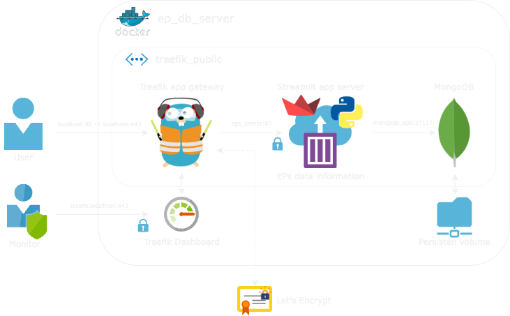
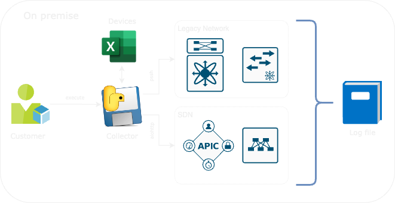

# Web Application Documentation

## Network Endpoint Snapshot Viewer

Welcome to the Network Endpoint Snapshot Viewer, a web application built using Streamlit. This application allows users to view and analyze endpoint information collected from network devices in the form of snapshots. With this application, you can explore various endpoints, perform comparisons between different snapshots, and access detailed information about network devices and interfaces.

## Table of Contents

- [Introduction](#introduction)
- [Getting Started](#getting-started)
  - [Installation](#installation)
  - [Running the Application](#running-the-application)
- [Main Features](#main-features)
  - [Authentication](#authentication)
  - [Dashboard](#dashboard)
  - [Database Profiler](#database-profiler)
  - [L2 Summary Information](#l2-summary-information)
  - [L3 Summary Information](#l3-summary-information)
  - [L2 Detailed Information](#l2-detailed-information)
  - [L3 Detailed Information](#l3-detailed-information)
  - [Endpoint Search](#endpoint-search)
  - [Compare Endpoints](#compare-endpoints)
  - [Upload Endpoint Logs](#upload-endpoint-logs)
- [Contributing](#contributing)
- [License](#license)

## Introduction

The Network Endpoint Snapshot Viewer is a powerful tool designed to help network administrators and engineers analyze and visualize endpoint information collected from network devices. By providing various dataframes and visualizations, this application simplifies the process of understanding network device details, endpoint history, and making informed decisions based on the collected data.

## Getting Started

### Running the Application locally

Once the dependencies are installed, you can run the application using the following command:
``````
streamlit run app/EP_Dashboard.py
``````
The application will be available at `http://localhost:8501` in your web browser.

> **Note:**  You need to setup a local MongoDB instance on port $MONGO_PORT and deploy the MAC OUI database DB: **mac_oui**, Collection: **mac_oui**. with user: $MONGO_USERNAME and $MONGO_PASSWORD (ENVs)

### Running the Application as Docker stack
<p align="center">
<picture>
  <source media="(prefers-color-scheme: dark)" srcset="figures/EPs_app-Server_b.png">
  <source media="(prefers-color-scheme: light)" srcset="figures/EPs_app-Server_w.png">
  
</picture>
</p>

1. Run the docker-compose yml for the app stack
``````
docker-compose -f docker-compose.yml up -d   
``````
2. Run the docker-compose yml for the app gateway
``````
docker-compose -f docker-compose.traefik.yml up -d
``````
> **Note_1:**  Maybe you will need to manually deploy the MAC OUI database DB: **mac_oui**, Collection: **mac_oui**.

> **Note_2:**  You can run the Streamlit application without traefik by runing "docker-compose up -d" this will use the docker-compose.override.yml to export the ports of streamlit and mongodb.

## Main Features

### Authentication

The application starts with an authentication prompt to ensure only authorized users can access the sensitive network data.

<p align="center">
  
</p>

*   ### Dashboard

    The Dashboard serves as the main landing page of the application. It provides an overview of the network endpoint snapshots and navigation links to other sections of the application. It's present several KPIs like MAC count, IPv4 count, EPs distribution between switches, etc.

    <p align="center">
      
    </p>

*   ### Database Profiler

    The Database Profiler page provides an overview of the collected endpoint snapshots. It displays essential statistics and metadata about the database, allowing users to understand the available data.

    <p align="center">
      
    </p>

*   ### L2 Summary Information

    The L2 Summary Information page presents a dataframe summarizing L2 (Link Layer) endpoint information. It includes details such as devices and their corresponding ports.

    <p align="center">
      
    </p>

*   ### L3 Summary Information

    The L3 Summary Information page displays a dataframe summarizing L3 (Network Layer) endpoint information. It includes details such as devices and their corresponding L3 interfaces.

    <p align="center">
      
    </p>

*   ### L2 Detailed Information

    On this page, users can access a detailed dataframe containing L2 endpoint information. The table presents devices and their associated ports, providing in-depth insights into L2 connectivity.

    <p align="center">
      
    </p>

    Information per endpoint:
    - mac.dot
    - MAC
	- device
    - vendor
    - epgdn         (ACI)
	- epg_encap     (ACI)
	- pctag         (ACI)
    - bd            (ACI)
	- bd_encap      (ACI)
	- local_vlan    (ACI)
	- port
	- vlan
	- description
	- Po members    (if port is Po)
	- policy group  (ACI)
	- prot
	- vpc
	- lldp.name     (Neighbor info if enable)
	- cdp.name      (Neighbor info if enable)
	- controller    (ACI with VMM)
	- hostingServer (ACI with VMM)
	- vm.name       (ACI with VMM)

*   ### L3 Detailed Information

    Similar to the L2 Detailed Information page, this section offers a detailed dataframe with L3 endpoint information. Users can explore devices and their corresponding L3 interfaces.

    <p align="center">
      
    </p>

    Information per endpoint:
    - mac.dot
    - MAC
	- device
    - vendor
    - ip.0   
    - vrf
	- bd        (ACI)
	- interface
	- scope     (ACI)

*   ### Endpoint Search

    The Endpoint Search feature enables users to search for endpoints using their IP address or MAC address. This allows for quick access to specific endpoint information. We can see the information in tables or the raw MongoDB reply.

    <p align="center">
      
    </p>

*   ### Compare Endpoints

    The Compare Endpoints page allows users to select and compare two different endpoint snapshots. The comparison provides a clear view of changes and updates between the two snapshots.

    <p align="center">
      
    </p>
> **Note:**  The "Enable color diff" checkbox activate dataframe pagination to keep up performance. 

*   ### Upload Endpoint Logs
    The Upload Endpoint Logs page allows the users to upload log files containing endpoint information collected by the local collector. This feature ensures seamless integration of new data into the application.

    <p align="center">
      
    </p>

    The necesary log come from the client EPs Collector:
<p align="center">
<picture>
  <source media="(prefers-color-scheme: dark)" srcset="figures/EPs_app-Collector_b.png">
  <source media="(prefers-color-scheme: light)" srcset="figures/EPs_app-Collector_w.png">
  
</picture>
</p>


## Contributing

We welcome contributions from the community to enhance the functionality and usability of the Network Endpoint Snapshot Viewer. If you find a bug or have an idea for an improvement, please open an issue.

## Contributing Articles and Repositories: Interesting and Insightful Articles to Check Out

* Streamli documentation https://docs.streamlit.io/library/api-reference
* Pandas documentation https://pandas.pydata.org/docs/reference/index.html#api
* Powerfull example with Traefik and FastAPI/Streamlit/Panel https://github.com/tiangolo/blog-posts/tree/master/deploying-fastapi-apps-with-https-powered-by-traefik
* Auto filters for pandas dataframe in streamlit https://github.com/wjbmattingly/streamlit-pandas
* Nice way to paginate st.dataframe https://medium.com/streamlit/paginating-dataframes-with-streamlit-2da29b080920 
* Traefik simple steps https://github.com/DoTheEvo/Traefik-simplest-step-by-step/blob/master/README.md

